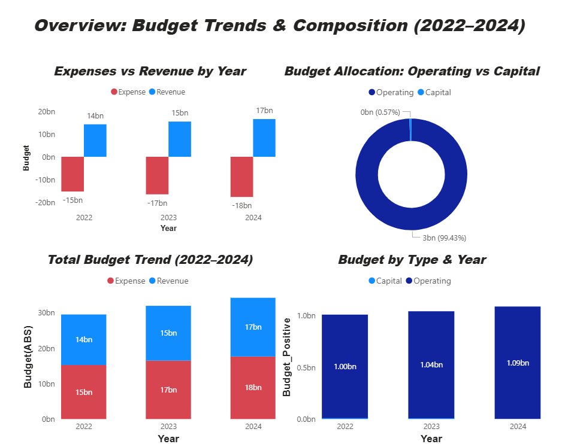
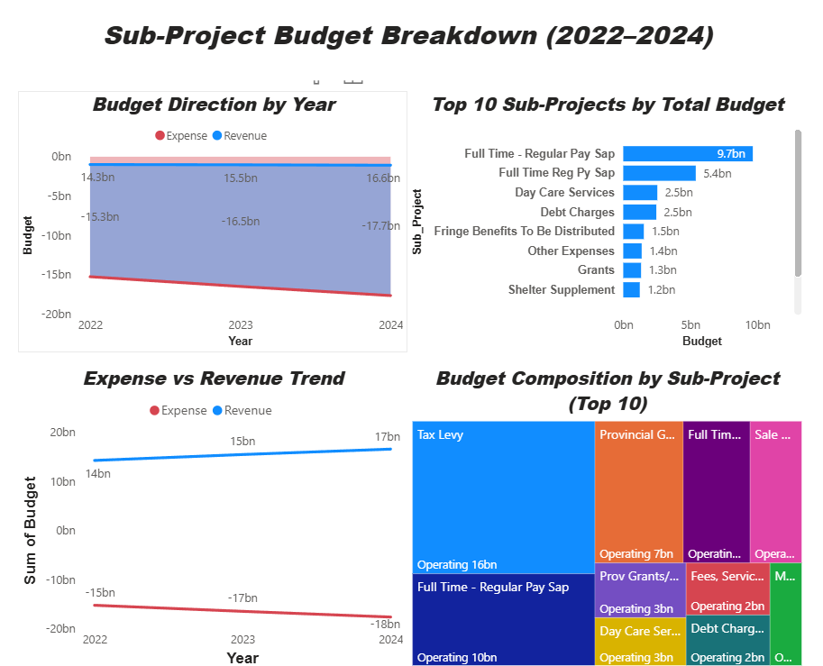
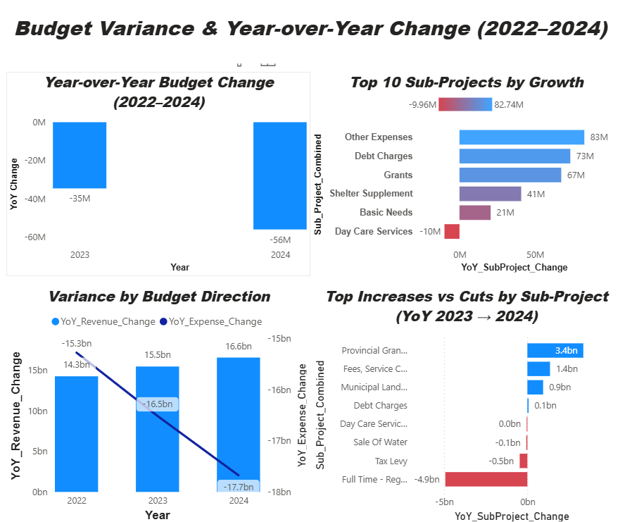

# Toronto Budget Tracker & Variance Model (2022–2024)

📊 A Power BI dashboard project simulating real-world financial oversight across City of Toronto budgets from 2022 to 2024. Focused on trend detection, variance analysis, and sub-project investment monitoring to support public finance decision-making.

---

## 📑 Table of Contents

- [🔍 Project Objective](#-project-objective)
- [🗂 Data Source](#-data-source)
- [💡 Business Challenge](#-business-challenge)
- [🧠 Key Insights Uncovered](#-key-insights-uncovered)
- [📁 Files](#-files)
- [📌 Features & Visuals](#-features--visuals)
- [📊 Sample Visuals](#-sample-visuals)
- [🛠 Tools Used](#-tools-used)
- [🧠 What I Learned](#-what-i-learned)
- [🗣 How I’d Explain It in an Interview](#-how-id-explain-it-in-an-interview)
- [🔗 Related Projects](#-related-projects)
- [✅ Status](#-status)

---

## 🔍 Project Objective

The City of Toronto manages billions in capital and operating budgets across hundreds of sub-projects. But decision-makers often struggle to see:

- Which areas are **growing too quickly or getting cut**
- Where costs are **misaligned year-over-year**
- How spending patterns shift between **funding types and sub-projects**

**This project models a solution**: a clean Power BI dashboard designed to provide **stakeholders with budget transparency**, **growth trends**, and **targeted insights** for better fiscal management.

---

## 🗂 Data Source

The data used in this project comes from the [City of Toronto Open Data Portal](https://open.toronto.ca/), specifically:

- **Capital and Operating Budgets** for 2022, 2023, and 2024
- Budget tables broken down by program, sub-project, and funding type
- CSV files accessed and manually cleaned for consistency and analysis

This dataset reflects publicly available municipal budget information and was used to simulate real-world financial analysis tasks, including budget variance, sub-project trends, and YoY change analysis.

---

## 💡 Business Challenge

> “How can we track budget shifts year over year and identify which programs are growing unsustainably or being underfunded?”

As a data analyst, I approached this like an internal finance team would:
- Structure and clean multi-year budget data
- Build dynamic visuals for revenue vs expense growth
- Create logic for **Year-over-Year (YoY)** and **sub-project variance**
- Highlight **top increases/cuts by sub-project**

---

## 🧠 Key Insights Uncovered

| Year | Revenue Change | Expense Change | Notes |
|------|----------------|----------------|-------|
| 2023 | +$15.5B        | –$16.5B        | Divergence shows overspending risk |
| 2024 | +$16.6B        | –$17.7B        | Deficit gap widening again |

- 📈 **Highest growth areas** (e.g. Debt Charges, Grants) were not matched by revenue.
- 🔻 **Sub-projects like Day Care Services saw cuts** despite increasing costs elsewhere.
- 🧭 Identified **top 10 growing sub-projects** for 2024 and flagged items for review.

---

## 📁 Files

| File | Description |
|------|-------------|
| `Toronto_Budget_Tracker_2022_2024.pbix` | Power BI dashboard with all visuals |
| `combined_budget_data.csv` | Cleaned budget data for 2022–2024 |

---

## 📌 Features & Visuals

- ✅ **YoY Change Tracking** (Revenue vs Expenses)
- ✅ **Top 10 Growth Sub-Projects**
- ✅ **Variance Breakdown by Budget Direction**
- ✅ **Treemap Composition by Spending Area**
- ✅ **Highlight of Cuts vs Increases**

---

## 📊 Sample Visuals

Here are a few screenshots from the final Power BI dashboard:

### 🔹 Page 1: Budget Overview by Year and Type

### 🔹 Page 2: Top Sub-Projects and Composition

### 🔹 Page 3: YoY Change & Variance Analysis

---

## 🛠 Tools Used

- **Power BI Desktop** – DAX, measures, custom tooltips
- **Excel / CSV Prep** – Data cleaning, merging
- **DAX Calculations** – YoY growth, sub-project variance, conditional formatting

---

## 🧠 What I Learned

- How to structure messy public finance data into clean, repeatable models
- How to think like a stakeholder: **What would a CFO care about?**
- How to present insights in a **narrative flow**, not just charts
- How to balance **data granularity** with high-level summaries

---

## 🗣 How I’d Explain It in an Interview

> “I wanted to simulate a real stakeholder use case — city budget oversight. I gathered and cleaned multi-year Toronto budget data, created dynamic visuals to track year-over-year changes, and built logic to highlight risky expense trends or underfunded programs. I used this to tell a simple story: where public funds are going, what’s changing, and where leadership should take a second look.”

---

## 🔗 Related Projects

- [Retail Data Insights (Power BI + SQL)](https://github.com/jxm-analytics/retail-data-insights-sql-powerbi)
- [Public Asset Strategy (Transit Portfolio ROI)](https://github.com/jxm-analytics/metrolinx-asset-strategy-case)

---

## ✅ Status

**Complete** – All visuals and logic tested. Ready for portfolio use and interview discussion.
